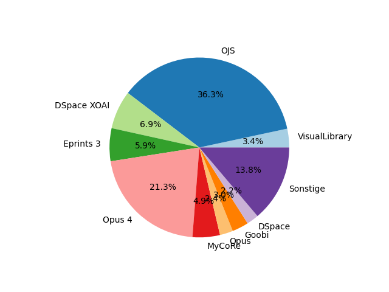

# DINI_Database_Scraper
Mit diesem Skript wird die Forschungsdatenrepositoriumsdatenbank der [Deutsche Initiative für Netzwerkinformation e. V.](https://dini.de/dienste-projekte/publikationsdienste) (DINI) gescrapt und die relevanten Daten extrahiert. Auf ihrer Grundlage können verschiedene statistische Untersuchungen zur deutschen Forschungsdatenrepositorienlandschaft angestellt werden. Beispielhaft veranschaulicht der folgende Pie-Chart die relative Verteilung aller Repositorien (Stand Januar 2024; Alle Repos, die mit unter 2% unterrepräsentiert sind, werden in der Kategorie "Sonstige" zusammengefasst).

